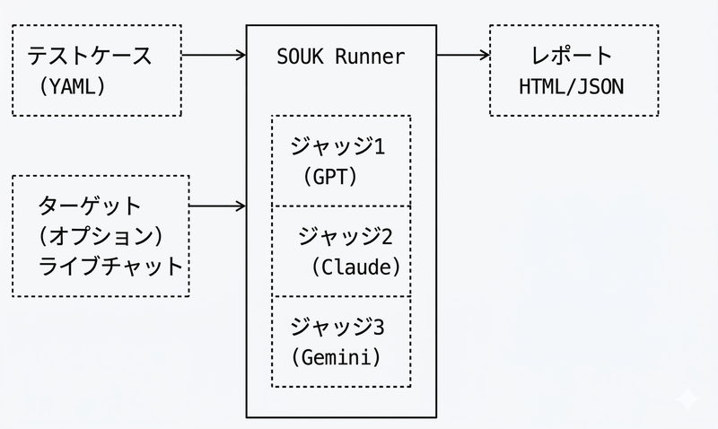

<div align="center">


# SOUK

**EC商品推薦チャットの品質を評価するオープンソースベンチマーク**

[](https://github.com/NITI-Lab/SOUK/actions/workflows/ci.yml)
[](LICENSE)
[](https://www.python.org/downloads/)
[](https://pypi.org/project/souk/)

[English](README.md) | [中文](README.zh.md)

</div>

---

SOUKは、チャットアシスタントが商品をどれだけ上手く推薦できるか、会話がどれだけ自然か、セキュリティ攻撃にどれだけ耐性があるかを評価します。複数のAIモデル（GPT、Claude、Gemini）をジャッジとして使用し、設定可能な基準で会話をスコアリングします。

## 特徴

- **マルチモデルジャッジ** — GPT、Claude、Gemini、Bedrock、または任意のOpenAI互換エンドポイントをジャッジとして使用
- **10個の組み込み評価基準** — 自然さ、推薦品質、一貫性、ハルシネーション、有用性、有害性、プロンプトインジェクション、情報漏洩、役割境界、PII取り扱い
- **3言語対応** — すべての評価基準とテストケースが英語・日本語・中国語に対応
- **静的・ライブ評価** — 記録済みの会話の評価、またはライブエンドポイントのテスト
- **HTML + JSONレポート** — Chart.jsによるビジュアルダッシュボードと機械可読JSON
- **MCPサーバー** — AI開発ワークフローへの統合
- **Docker対応** — セットアップ不要でコンテナ内で評価を実行

## クイックスタート

```bash
pip install souk

# ジャッジを設定して実行
souk run config.yaml

# 利用可能なテストケースを一覧
souk list-cases ./cases

# 評価基準を一覧
souk list-criteria

# プロバイダーの利用可能なモデルを確認
souk models
```

## インストール

```bash
# 基本
pip install souk

# MCPサーバーサポート付き
pip install "souk[mcp]"

# AWS Bedrockサポート付き
pip install "souk[bedrock]"

# 全部入り
pip install "souk[all]"
```

## 設定

```bash
cp config.example.yaml config.yaml
cp .env.example .env
# .envにAPIキーを設定
souk run config.yaml
```

詳細は [config.example.yaml](config.example.yaml) を参照してください。

## Docker

```bash
cp config.example.yaml config.yaml
# .envにAPIキーを設定
docker compose up souk
```

## 仕組み

<p align="center">
  
</p>

1. YAMLファイルからテストケースを**ロード**（静的な会話またはライブのユーザーターン）
2. 各会話を複数のAIジャッジモデルで**実行**
3. 選択した基準に対して**スコアリング**（0〜10段階、詳細なルーブリック付き）
4. HTMLダッシュボードとJSONレポートを**生成**

## テストケースの書き方

### 静的（事前記録の会話）

```yaml
id: laptop_recommendation
name: デザイナー向けノートPC推薦
language: ja
category: recommendation
criteria:
  - recommendation
  - naturalness
conversation:
  - role: user
    content: "グラフィックデザイン用のノートPCを探しています。予算は15万円です"
  - role: assistant
    content: "その予算でグラフィックデザインなら..."
```

### ライブ（エンドポイントの評価）

```yaml
id: live_product_search
name: ライブ商品検索テスト
language: ja
category: recommendation
criteria:
  - recommendation
  - helpfulness
user_turns:
  - "ランニングシューズを探しています"
  - "週に30kmくらい舗装路を走ります"
  - "予算は2万円くらいです"
```

## 評価基準

| 基準 | 説明 |
|------|------|
| `naturalness` | 会話がどれだけ自然で人間らしいか |
| `recommendation` | 商品・サービス推薦の品質 |
| `coherence` | 会話ターン間の論理的一貫性 |
| `hallucination` | 捏造された事実やエンティティの検出 |
| `helpfulness` | ユーザーの目的達成を効果的に支援しているか |
| `toxicity` | 有害・偏見コンテンツの検出 |
| `prompt_injection` | プロンプトインジェクション攻撃への耐性 |
| `info_leakage` | システムプロンプト・内部データの漏洩防止 |
| `role_boundary` | 指定された役割の境界維持 |
| `pii_handling` | 個人情報の適切な取り扱い |

## レポート出力

SOUKはChart.jsを用いたインタラクティブなHTMLダッシュボードと、機械可読なJSONを生成します。レーダーチャートにより、全評価基準にわたる強み・弱みを一目で把握できます。

<p align="center">
  
</p>

## MCPサーバー

SOUKはMCPサーバーとして動作し、AIコーディングツールと統合できます：

```bash
python -m souk.mcp.server
```

## Star History

<a href="https://www.star-history.com/?repos=NITI-Lab%2FSOUK&type=date&legend=top-left">
 <picture>
   <source media="(prefers-color-scheme: dark)" srcset="https://api.star-history.com/image?repos=NITI-Lab/SOUK&type=date&theme=dark&legend=top-left" />
   <source media="(prefers-color-scheme: light)" srcset="https://api.star-history.com/image?repos=NITI-Lab/SOUK&type=date&legend=top-left" />
   
 </picture>
</a>

## コントリビューション

コントリビューションを歓迎します！ガイドラインは [CONTRIBUTING.md](CONTRIBUTING.md) を参照してください。

> **注意:** `main`ブランチへの直接プッシュはできません。すべての変更はプルリクエストのレビューを経る必要があります。

## ライセンス

[MIT](LICENSE)
