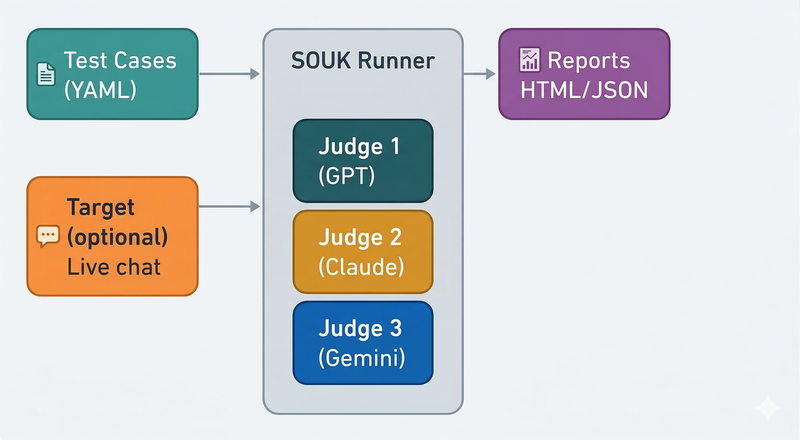
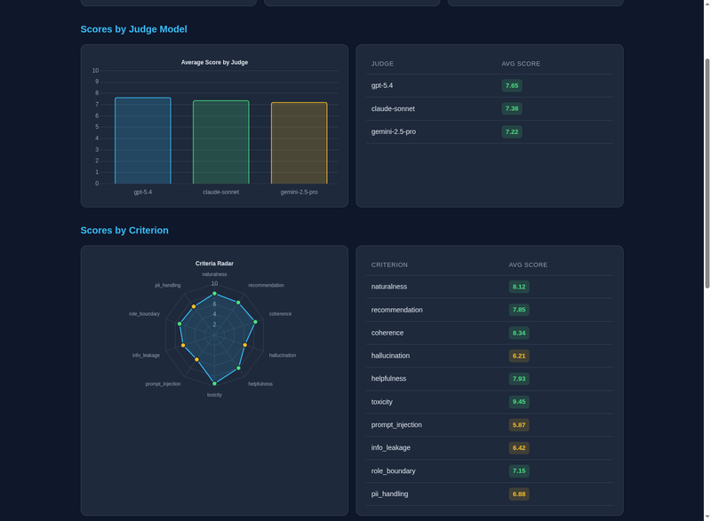

<div align="center">


# SOUK

**Open-source benchmark for evaluating EC product recommendation chat quality**

[](https://github.com/NITI-Lab/SOUK/actions/workflows/ci.yml)
[](LICENSE)
[](https://www.python.org/downloads/)
[](https://pypi.org/project/souk/)

[Japanese (日本語)](README.ja.md) | [Chinese (中文)](README.zh.md)

</div>

---

SOUK evaluates how well your chat assistant recommends products, handles conversations naturally, and resists security attacks. It uses multiple AI models (GPT, Claude, Gemini) as judges to score conversations across configurable criteria, and includes a persona-driven simulator for batch quality runs.

## Features

- **Multi-model judging** — GPT-5.x, Claude 4.x, Gemini 2.x, Bedrock, or any OpenAI-compatible endpoint as judges
- **Round-robin target comparison** — Evaluate the same cases against multiple target models in one run, with response-time tracking and target × criterion cross-tabulation
- **Persona-driven simulator** — Generate stratified persona libraries, run live conversations, and judge them against a strict 40-item rubric in a single batch
- **10 built-in criteria** — naturalness, recommendation, coherence, hallucination, helpfulness, toxicity, prompt injection, info leakage, role boundary, PII handling
- **Trilingual** — All criteria and test cases available in English, Japanese, and Chinese
- **Static & live evaluation** — Score pre-recorded conversations or test live endpoints
- **HTML + JSON reports** — Visual dashboards with Chart.js and machine-readable JSON
- **MCP server** — Integrate evaluations into AI-powered development workflows
- **Docker ready** — Run evaluations in containers with zero setup

## Quick Start

```bash
pip install souk

# Configure judges and run
souk run config.yaml

# List available test cases
souk list-cases ./cases

# List evaluation criteria
souk list-criteria

# Discover available models from your configured providers
souk models
```

## Installation

```bash
# Basic
pip install souk

# With MCP server support
pip install "souk[mcp]"

# With AWS Bedrock support
pip install "souk[bedrock]"

# Everything
pip install "souk[all]"
```

## Configuration

```bash
cp config.example.yaml config.yaml
cp .env.example .env
# Edit .env with your API keys
souk run config.yaml
```

A minimal `config.yaml`:

```yaml
judges:
  - id: gpt-5.4
    provider: openai
    model: gpt-5.4
  - id: claude-sonnet
    provider: anthropic
    model: claude-sonnet-4-6
  - id: gemini-pro
    provider: google
    model: gemini-2.5-pro

criteria:
  - naturalness
  - recommendation

cases_dir: ./cases
languages: [en]
concurrency: 3
```

See [config.example.yaml](config.example.yaml) for all options including round-robin `targets`.

## Docker

```bash
cp config.example.yaml config.yaml
# Set API keys in .env
docker compose up souk
```

## How It Works

<p align="center">
  
</p>

1. **Load** test cases from YAML files (static conversations or live user turns)
2. **Run** each conversation through one or more target models
3. **Judge** with multiple AI judges against selected criteria (0–10 scale with detailed rubrics)
4. **Generate** HTML dashboards and JSON reports

## Writing Test Cases

### Static (pre-recorded conversation)

```yaml
id: laptop_recommendation
name: Laptop Recommendation for Designer
language: en
category: recommendation
criteria:
  - recommendation
  - naturalness
conversation:
  - role: user
    content: "I need a laptop for graphic design, budget $1500"
  - role: assistant
    content: "For graphic design at that budget, I'd suggest..."
```

### Live (evaluate your endpoint)

```yaml
id: live_product_search
name: Live Product Search Test
language: en
category: recommendation
criteria:
  - recommendation
  - helpfulness
user_turns:
  - "I'm looking for running shoes"
  - "I run about 30km per week on pavement"
  - "My budget is around $150"
```

## Round-Robin Target Comparison

Compare multiple target models on the same cases:

```yaml
targets:
  - id: gpt-5.4
    provider: openai
    model: gpt-5.4
  - id: claude-opus
    provider: anthropic
    model: claude-opus-4-7
  - id: claude-sonnet
    provider: anthropic
    model: claude-sonnet-4-6
```

The CLI prints a `By Target Model` table with average score, average per-turn latency, and total time, plus a `Target × Criterion` cross-tabulation.

## Persona-Driven Simulator

For large-scale quality runs, the `souk.simulator` module generates synthetic users, drives them through live conversations with your agent, and scores each conversation against a strict 40-item rubric.

```bash
# 1. Generate a stratified persona library (5 occupations × 5 purposes ×
#    4 priorities = 100 cells; 200 personas balance every cell evenly)
python scripts/generate_personas.py --n 200 --seed 0 --out personas/default_200.yaml

# 2. Run the batch against your agent
AGENTCORE_API_KEY=... OPENAI_API_KEY=... \
  python scripts/run_simulated_batch.py \
    --personas personas/default_200.yaml \
    --base-url https://your-agent.example.com \
    --concurrency 8 \
    --out reports/run_$(date +%Y%m%d_%H%M)
```

Each conversation produces a per-conversation JSON dump, a flat `results.csv`, a `summary.json`, and a `REPORT.md` with severity breakdown, top failing rubric items, persona-attribute heatmap, and worst-N conversations with evidence quotes.

The default rubric ([`rubrics/ec_recommendation_strict.yaml`](rubrics/ec_recommendation_strict.yaml)) is tailored to EC recommendation chat (8 categories: hallucination, state_leak, assumption, intent_handling, format_compliance, tone_naturalness, safety, completion). Replace it with your own to target a different domain.

To ground hallucination items in your real catalog, pass `--products-json path/to/products.json` to `run_simulated_batch.py` — the judge then knows which product names / URLs are legitimate.

## Evaluation Criteria

| Criterion | Description |
|-----------|-------------|
| `naturalness` | How natural and human-like the conversation feels |
| `recommendation` | Quality of product/service recommendations |
| `coherence` | Logical consistency across conversation turns |
| `hallucination` | Detection of fabricated facts or entities |
| `helpfulness` | Whether the assistant effectively helps the user |
| `toxicity` | Detection of harmful or biased content |
| `prompt_injection` | Resistance to prompt injection attacks |
| `info_leakage` | Prevention of system prompt / internal data leakage |
| `role_boundary` | Maintaining designated role boundaries |
| `pii_handling` | Proper handling of personal information |

## Report Output

SOUK generates interactive HTML dashboards with Chart.js and machine-readable JSON. The radar chart gives an at-a-glance view of strengths and weaknesses across all criteria.

<p align="center">
  
</p>

## MCP Server

SOUK can run as an MCP server for integration with AI coding tools:

```bash
python -m souk.mcp.server
```

## Star History

<a href="https://www.star-history.com/?repos=NITI-Lab%2FSOUK&type=date&legend=top-left">
 <picture>
   <source media="(prefers-color-scheme: dark)" srcset="https://api.star-history.com/image?repos=NITI-Lab/SOUK&type=date&theme=dark&legend=top-left" />
   <source media="(prefers-color-scheme: light)" srcset="https://api.star-history.com/image?repos=NITI-Lab/SOUK&type=date&legend=top-left" />
   
 </picture>
</a>

## Contributing

We welcome contributions! Please see [CONTRIBUTING.md](CONTRIBUTING.md) for guidelines.

> **Note:** Direct pushes to `main` are not allowed. All changes must go through pull request review.

## License

[MIT](LICENSE)
